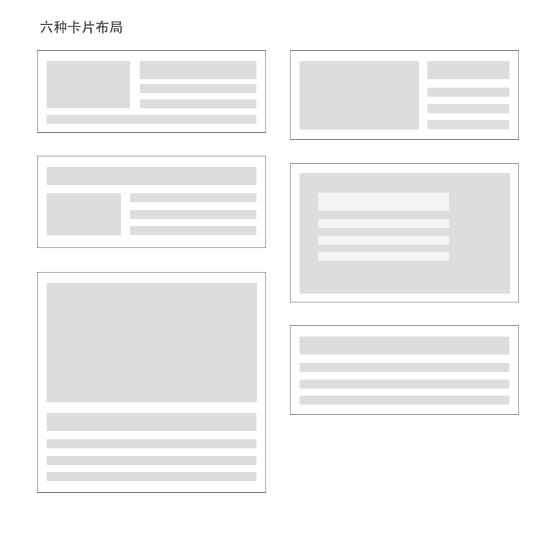
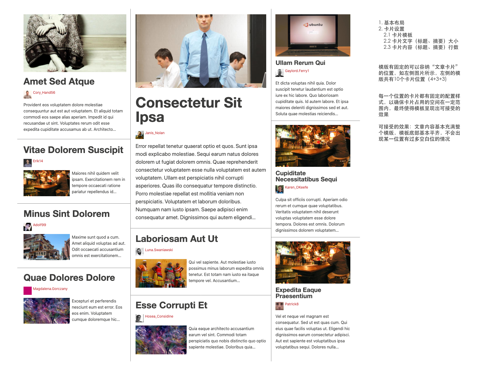

# Feat.com Feed 模版

Feat.com 上的信息流模版样式整理。

目标：页面内容有丰富的排版效果。给定任意数量的文章，使得文章内容基本充满整个页面。内容底部基本平齐，不会出现某一位置有过多空白位的情况。下图为模板示例：

[演示页面](https://feat.github.io/feed-template/)

**卡片样式**



**模板样式**




## 卡片模板命名规则

使用罗马数字作为后缀，给模板命名。

- 模板一： `CardI`
- 模板二： `CardII`
- 模板三： `CardIII`
- 模板四： `CardIV`
- 模板五： `CardV`
- 模板六： `CardVI`

## Feed 模板命名规则

Feed 模板命名采用与 卡片模板相同的命名规则，示例：

- 模板一： `FeedTemplateI`
- 模板二： `FeedTemplateII`
- 模板三： `FeedTemplateIII`
- ...

Feed 模板内的卡片字体大小控制

- 标题。 有三个大小尺寸： king(大), queen(中), jack(小)
- 正文。 有三个大小尺寸： king(大), queen(中), jack(小)
- 标题行数，使用 clamp 来控制最大内容高度
- 正文行数，使用 clamp 来控制最大内容高度

变量组合： 

```
Template 
  Layout
  Card 
    title size
    title line count
    body size
    body line count
```

## 参与贡献

我们欢迎大家提交不同的模板样式。在 issue 中提交截图，或者 根据我们的代码规范进行编辑后进行提交。

### 本地开发

这个项目使用了 sass 作为 css 的预编译器。CSS 类名遵循 BEM 代码规范，为编写 `.scss` 提供了几个辅助 `mixin`: 

```scss
// ns --> namespace
@include block(ns(Block)) {
    @include element(element) {
        color: red;
    }
}
// --> .ui-Block__element { color: red; }
```


**启动项目**

1. 拉取仓库

```bash
$ git clone https://www.github.com/feat/feed-template.git
```

2. 安装依赖

```bash
$ npm install
```

3. 启动开发服务器

```bash
$ npm start
```

